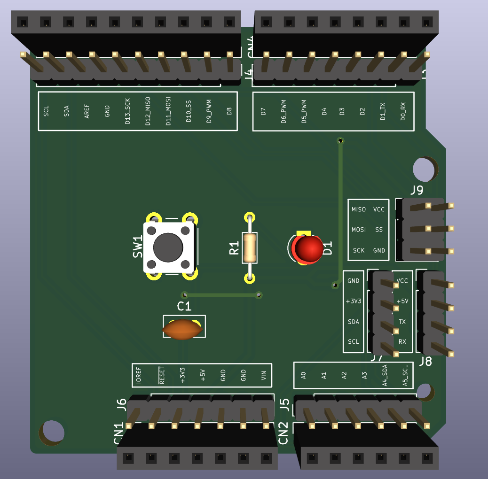
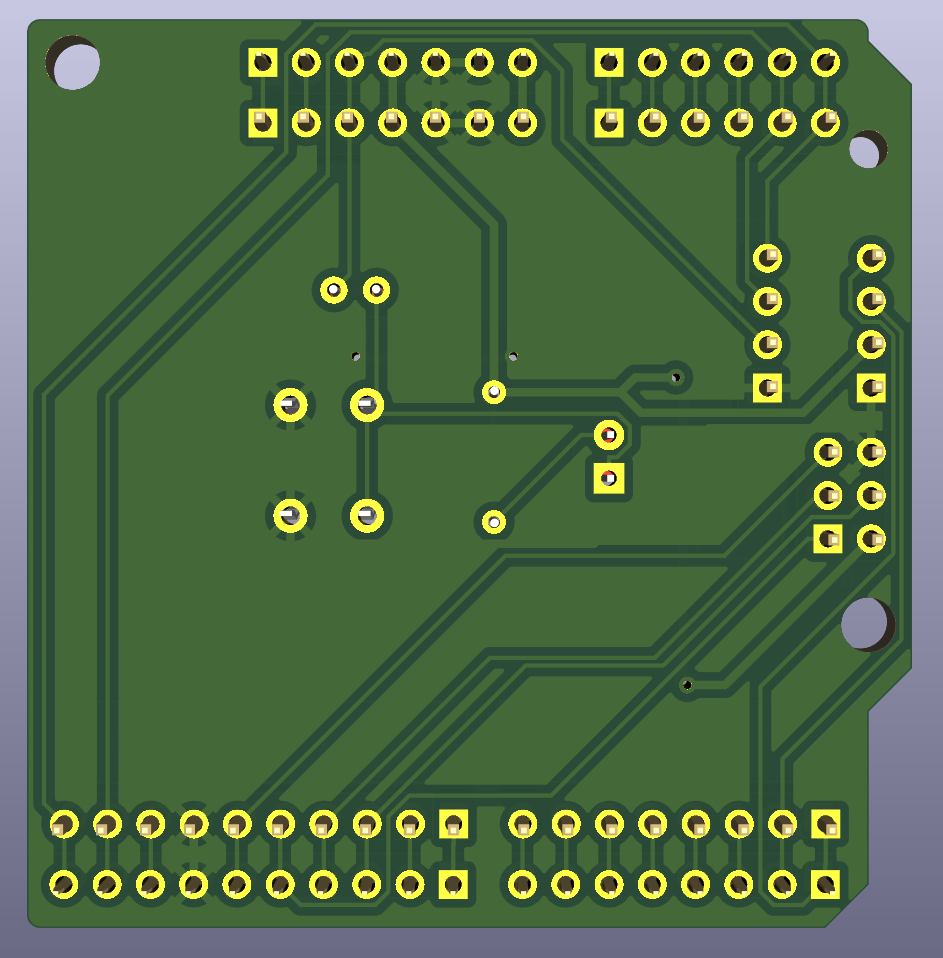

# Custom Interface Shield — Arduino Uno GPIO Breakout

A zero-stress, two-layer shield that maps every Arduino Uno GPIO pin to labeled external 2.54 mm headers. Perfect for learning layer stacks, DRC, and silkscreen discipline.

## Photos

## Features

- Maps all Arduino Uno GPIO pins to labeled 2.54mm headers
- Digital pins D0–D13 breakout (D0–D7 and D8–D13 as separate headers)
- Analog pins A0–A5 breakout
- Power rail header (3V3, 5V, GND, GND, RESET, IOREF)
- I2C sub-header (GND, VCC, SDA, SCL)
- UART sub-header (GND, VCC, TX, RX)
- SPI sub-header (2×3 pin header)
- Power LED indicator
- Reset button

## Pinout

| Header | Pins |
|--------|------|
| J3 - Digital Low | D0–D7 |
| J4 - Digital High | D8–D13, GND, AREF |
| J5 - Analog | A0–A5 |
| J6 - Power | 3V3, 5V, GND, GND, RESET, IOREF |
| J7 - I2C | GND, 3V3, SDA, SCL |
| J8 - UART | GND, 5V, TX, RX |
| J9 - SPI | MISO, MOSI, SCK, SS, 5V, GND |

## Components

| Ref | Description | Footprint |
|-----|-------------|-----------|
| CN1–CN4 | Arduino Uno stacking headers | 2.54mm pin sockets |
| J3–J9 | Breakout headers | 2.54mm pin headers |
| R1 | 330Ω resistor | AXIAL_0.3 |
| LED1 | Green 3mm LED | LED_D3.0mm |
| C1 | 100nF capacitor | C_Disc_D5 |
| SW1 | Tactile reset button | SW_PUSH_6mm |

## PCB

- 2-layer board (68.6mm × 53.3mm)
- Top: Components and signal traces
- Bottom: Solid GND copper fill

## KiCad Notes

- Use `Connector_Arduino` library for shield headers
- Use `Connector_Generic` for breakout headers
- Route horizontally from CN headers → breakout headers
- Label every breakout pin on silkscreen
- Run DRC before generating Gerbers
