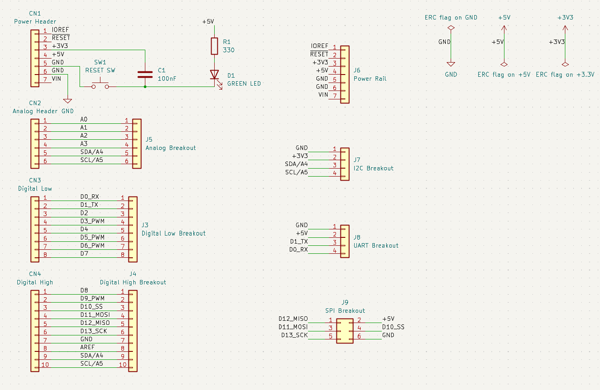

# Custom Interface Shield — Arduino Uno GPIO Breakout

A two-layer shield that maps every Arduino Uno GPIO pin to labeled external 2.54 mm headers. Perfect for learning PCB design, DRC, and silkscreen discipline.

## Features

- Maps all Arduino Uno GPIO pins to labeled 2.54mm headers
- Digital pins D0–D13 breakout (D0–D7 and D8–D13 as separate headers)
- Analog pins A0–A5 breakout
- Power rail header (IOREF, RESET, 3V3, 5V, GND, GND, VIN)
- I2C sub-header (GND, VCC, SDA, SCL)
- UART sub-header (GND, VCC, TX, RX)
- SPI sub-header (2×3 pin header)
- Power LED indicator
- Reset button with debounce capacitor

## Pinout

### Arduino Stacking Headers (CN1–CN4)

| Header | Description |
|--------|-------------|
| CN1 | Power (7-pin): IOREF, RESET, +3V3, +5V, GND, GND, VIN |
| CN2 | Analog (6-pin): A0–A5, SDA/A4, SCL/A5 |
| CN3 | Digital Low (8-pin): D0–D7 |
| CN4 | Digital High (10-pin): D8–D13, GND, AREF, SDA/A4, SCL/A5 |

### Breakout Headers

| Ref | Description | Pins |
|-----|-------------|------|
| J3 | Digital Low | D0–D7 |
| J4 | Digital High | D8–D13, GND, AREF, SDA, SCL |
| J5 | Analog | A0–A5 |
| J6 | Power Rail | IOREF, RESET, 3V3, 5V, GND, GND, VIN |
| J7 | I2C | GND, 3V3, SDA, SCL |
| J8 | UART | GND, 5V, TX, RX |
| J9 | SPI | MISO, MOSI, SCK, SS, 5V, GND |

## Components

| Ref | Description | Footprint |
|-----|-------------|-----------|
| CN1–CN4 | Arduino Uno stacking headers | PinSocket 2.54mm |
| J3–J9 | Breakout headers | PinHeader 2.54mm |
| D1 | Green 3mm LED | LED_D3.0mm |
| R1 | 330Ω resistor | AXIAL_0.3 |
| C1 | 100nF capacitor (RESET debounce) | C_Disc_D5 |
| SW1 | Tactile reset button | SW_PUSH_6mm |

## PCB Specifications

- **Dimensions:** 68.6mm × 53.3mm (standard Uno shield size)
- **Layers:** 2-layer (Top: components + signals, Bottom: solid GND fill)
- **Thickness:** 1.6mm FR4
- **Finish:** HASL (Green solder mask)

## Design Notes

- C1 acts as a RESET debounce capacitor connected to SW1
- LED (D1) provides power-on indication
- CN4 includes SDA/A4 and SCL/A5 pins matching the actual Arduino Uno R3 pinout
- All THT components for easy hand-soldering

## License

MIT
